# react-native-font-list

### A simple component to render a list of all fonts for iOS [and android, later]

The list was originally pulled from the following site:

https://infinitbility.com/react-native-font-family-list

The reason why this has be re-created is because there were several fonts that would not load.

When I get around to it, i'll post one for Android.

## iOS Notes

Tested with:

```json
"react-native": "0.63.4"
```

iOS Simulator:

```
iOS 14.4
```

## Android

Feel free to open a pull request or i'll add it later.

## Screenshots

### iOS

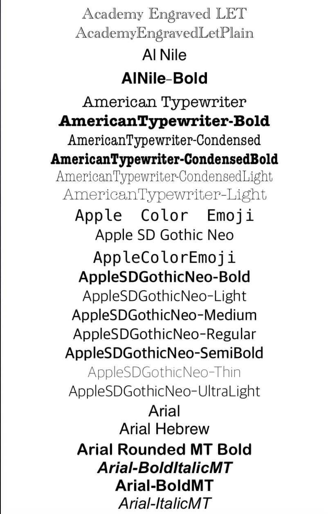
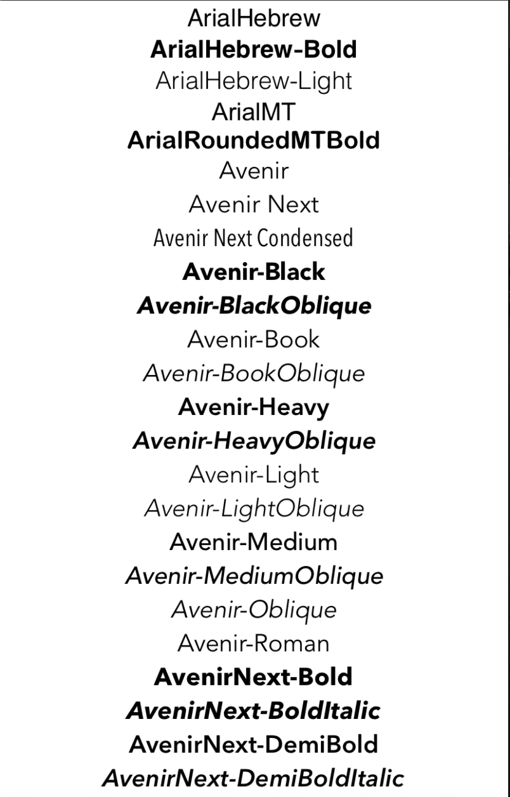
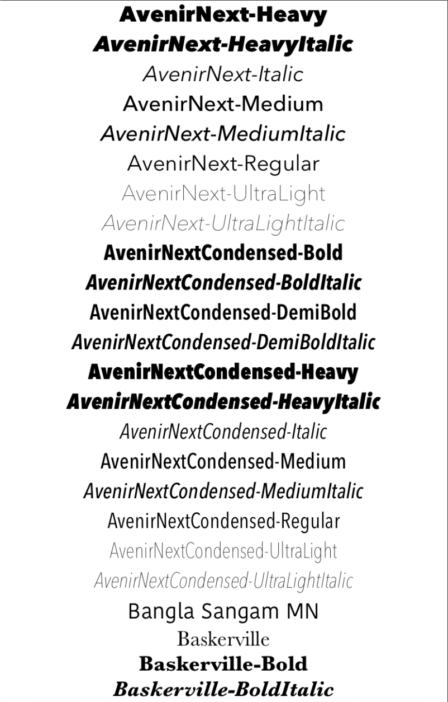
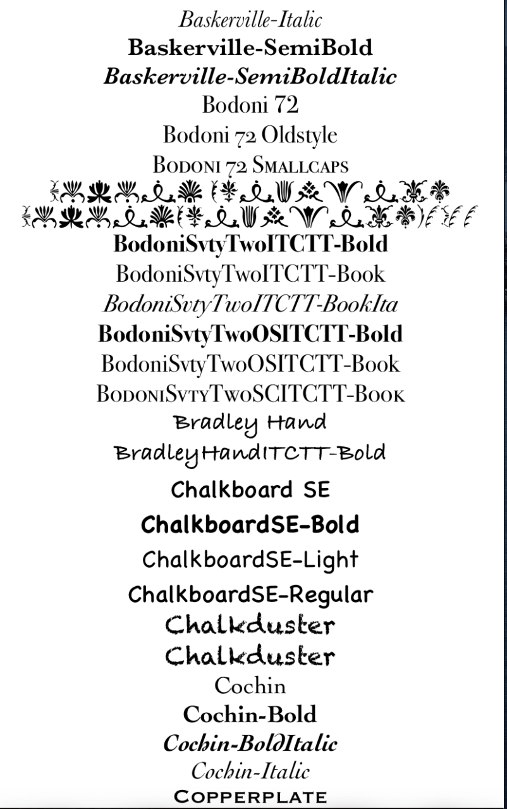
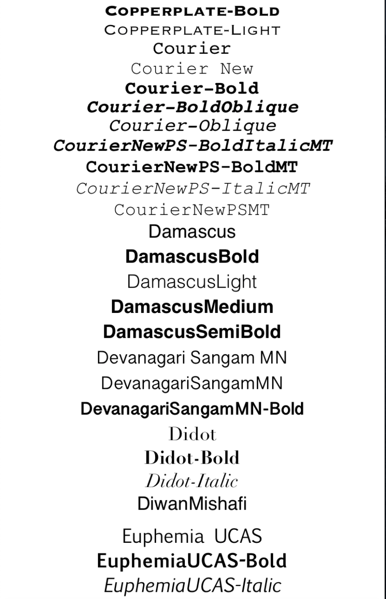
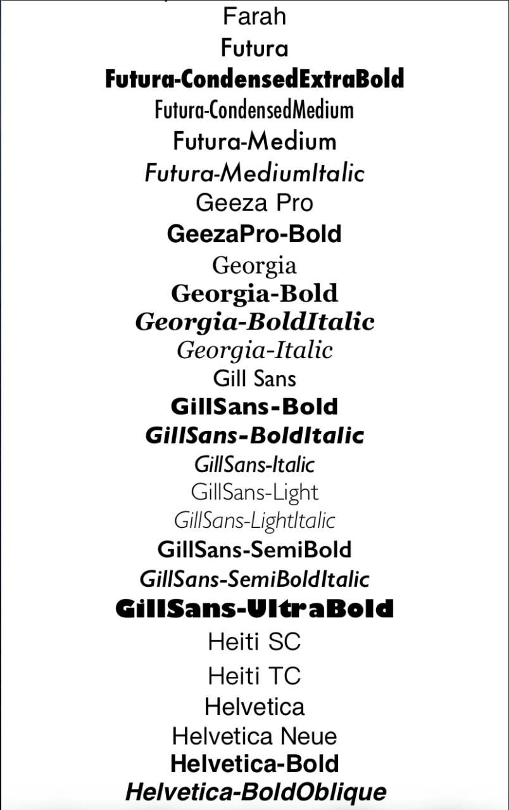
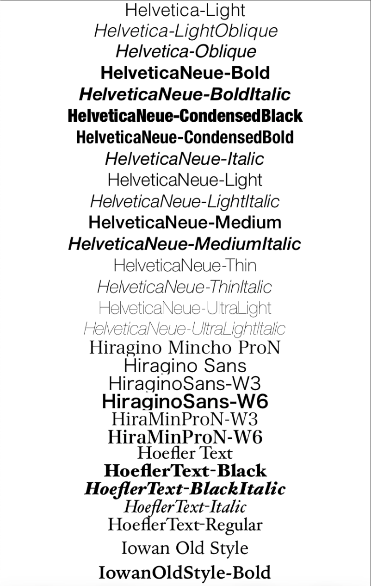
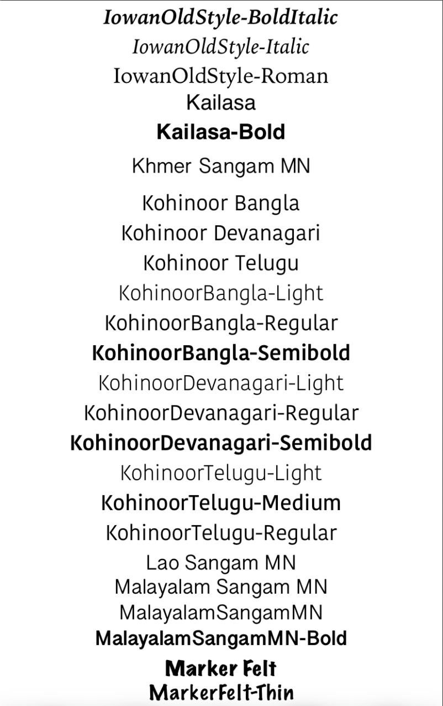
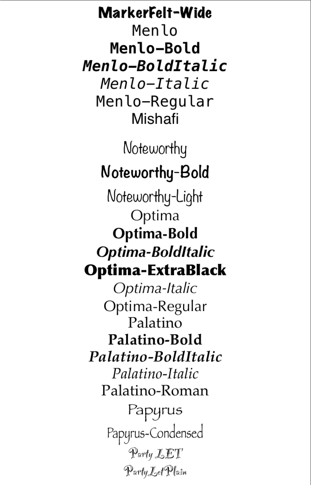
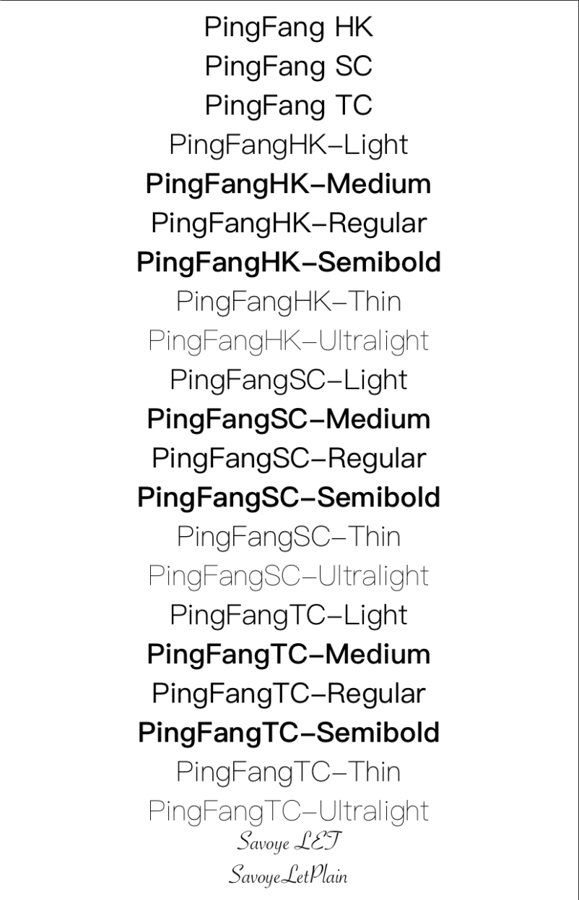
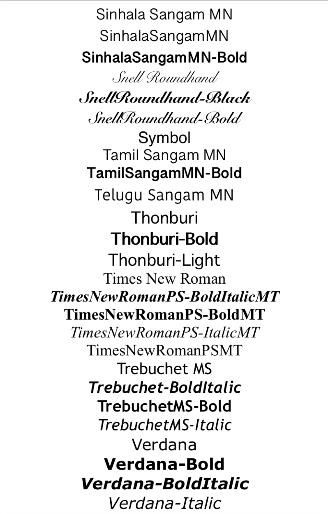

